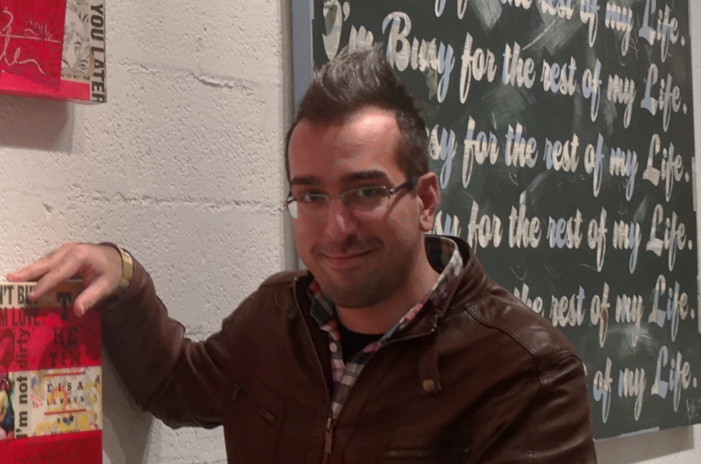

<h2 class="page-title">Ali Afroozeh</h2>

<section style="margin-top: 20px;">

I am a PhD student at <a href="https://www.cwi.nl/">CWI</a>, located in Amsterdam, The Netherlands.

My research interests include programming languages in general and 
parsing techniques in particular. With <a href="http://anastassija.github.io">Anastasia Izmaylova</a>, 
we developed a faster GLL parser, a data-dependent parsing framework called Iguana, and 
general parser combinators.

Before starting my PhD, I obtained my Master's degree with distinction (cum laude)
from Eindhoven University of Technology in 2012. Before that I was involved in 
enterprise Java development.

You can download my CV as <a href="CV.pdf" target="_blank">PDF</a>.

</section>

